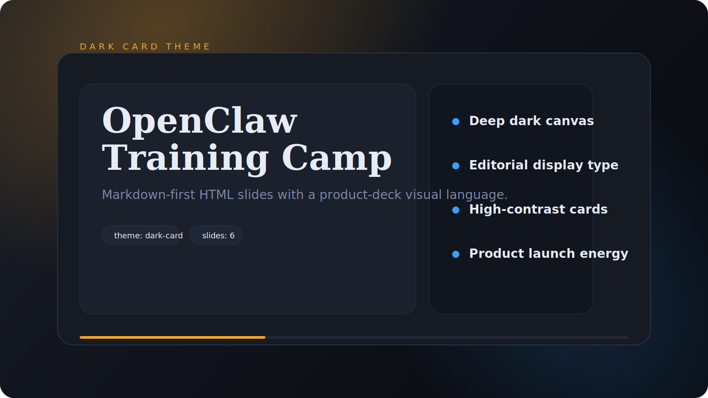
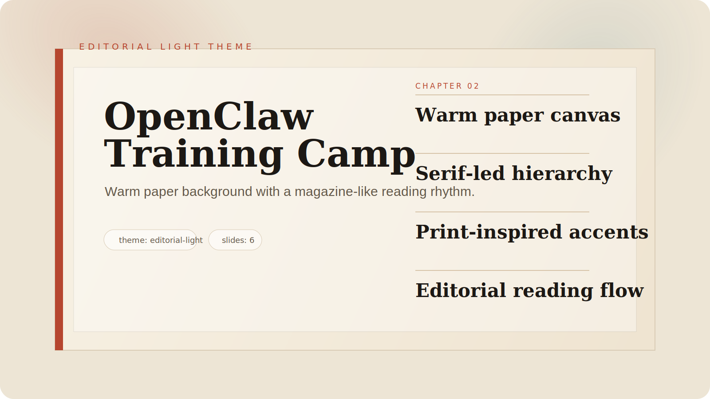

# md-to-html-slides

**语言:** [English](./README.md) | 简体中文

把文字语言变成适合演讲的视觉语言，帮助演讲者更清晰、更有说服力地表达。

## 产品使命

`md-to-html-slides` 是一个 Markdown-first 的展示系统，面向演讲者、教育者、创始人和业务运营者。
它帮助用户把原始笔记、草稿内容和结构化 Markdown 转成网页原生的 HTML 展示稿，更容易演示、更容易发布，也更容易维护。

## 它是什么

这个项目首先不是一个 PPT 克隆工具。
它更准确地说是一个 agent 驱动的展示系统，会：

- 理解内容结构
- 把文字语言转成适合表达的展示结构
- 以演讲者友好的 HTML 形式完成渲染

当前公开边界：

- 当前产品仍然以 `deck` 为主
- 当前输出仍是单文件 HTML
- 后续展示模式会扩展到 `roadmap`、`briefing`、`storyflow`

## 预览

### Dark Card



运行示例命令后的输出路径：`.tmp/examples/01-agent.html`

### Editorial Light



运行示例命令后的输出路径：`.tmp/examples/01-agent-editorial.html`

## 规范接口

项目正在朝 `CLI-first` 模式收敛：

- `CLI` 是 `plan / expand / build` 工作流的 canonical interface
- `Studio` 是本地薄壳，用于 clarification、outline 编辑和 HTML 预览
- `agent` 模块聚焦 planning、rewriting 和 fallback
- `shared` 模块负责稳定 semantic contract 和 render-deck normalization
- `skill` 现在是可复用表达策略的首选抽象
- `profile` 仍作为兼容别名保留在迁移期
- CLI clarification 同时支持交互式和非交互式执行

当前规范 artifact 主链为：

- `outline.json`
- `expanded.json`
- `render-deck.json`
- `HTML`

## Studio Demo

现在有一个可运行的最小 Studio 演示：

```bash
npm run studio
```

然后打开：

`http://127.0.0.1:4173/`

它包含：

- 左侧 Markdown 编辑器
- skill 选择器
- 主题实时切换
- 右侧 iframe 预览
- 一键复制 HTML 和新窗口打开

## 当前方向

- 输入：`Markdown + images`
- 输出：单文件 `HTML` 展示形态
- 当前默认模式：`deck`
- 后续目标模式：`roadmap`、`briefing`、`storyflow`
- 主题：`dark-card`、`tech-launch`、`signal-blue`、`editorial-light`
- 技能：`general`、`pitch-tech-launch`
- 当前重点：设计质量、响应式布局、简单发布
- 当前非目标：完整在线编辑器、完整 PPT 替代、复杂运行时依赖

## 仓库结构

```text
md-to-html-slides/
├─ assets/
├─ README.md
├─ LICENSE
├─ .gitignore
├─ docs/
├─ skills/
├─ templates/
├─ scripts/
├─ fixtures/
└─ studio/
```

## 路线图

### Phase 1

- 定义稳定的 Markdown 约定
- 生成干净的单文件 HTML 输出
- 支持标题、正文、图片、对比、总结页
- 包含键盘导航、触摸导航、进度条和响应式视口适配

### Phase 2

- 提升自动分页质量
- 提升图片、代码块和高密度内容的布局效果
- 增加 frontmatter 配置和 CLI 入口能力

### Phase 3

- 增加可选的 `pdf`、`pptx`、`docx` 导入路径
- 增加 presenter notes 支持
- 增加可复用的主题 / 模板继承

## 自带样本

- `fixtures/course/clean/openclaw-intro.md`: 课程型输入样本
- `fixtures/pitch/clean/product-pitch.md`: pitch 型输入样本
- `skills/founder-pitch.json`: 可直接使用的自定义 skill-file 示例
- `skills/templates/pitch-tech-launch-template.json`: 本地 skill-file 模板
- `.tmp/examples/01-agent.html`: `dark-card` 生成结果
- `.tmp/examples/01-launch-tech.html`: `tech-launch` 生成结果
- `scripts/build.mjs`: canonical CLI 的 bootstrap wrapper

## 当前状态

这是一个早期阶段的开源项目。当前重点是让一份 Markdown 稳定地生成一份适合演讲的 HTML 展示稿，并以 `deck` 作为默认模式。

## NPM Scripts

### 核心命令

```bash
npm run core:themes
npm run core:skills
npm run studio
```

### 测试命令

```bash
npm run test
npm run test:fallback
npm run test:render-deck
npm run test:cli
npm run test:llm
npm run test:llm:ab
```

### 示例命令

```bash
npm run example:validate-skill
npm run example:plan:skill-file
npm run example:validate
npm run example:plan
npm run example:expand
npm run example:render-deck
npm run example:render
npm run example:build
npm run example:build:editorial
npm run example:build:launch
npm run example:preview
```

或者直接运行 canonical CLI：

```bash
node ./scripts/build.mjs themes
node ./scripts/build.mjs validate-skill ./skills/founder-pitch.json
node ./scripts/build.mjs validate ./fixtures/course/clean/openclaw-intro.md
node ./scripts/build.mjs skills
node ./scripts/build.mjs plan ./fixtures/pitch/clean/product-pitch.md --skill-file ./skills/founder-pitch.json
node ./scripts/build.mjs plan ./fixtures/course/clean/openclaw-intro.md --skill general
node ./scripts/build.mjs expand ./fixtures/course/clean/openclaw-intro.md --skill general
node ./scripts/build.mjs render-deck ./tmp/expanded.json -o ./tmp/render-deck.json
node ./scripts/build.mjs render ./tmp/render-deck.json -o ./.tmp/examples/custom.html --theme signal-blue
node ./scripts/build.mjs build ./fixtures/course/clean/openclaw-intro.md -o ./.tmp/examples/01-agent.html --skill general
node ./scripts/build.mjs build ./fixtures/course/clean/openclaw-intro.md -o ./.tmp/examples/01-agent-editorial.html --theme editorial-light --skill general
node ./scripts/build.mjs build ./fixtures/pitch/clean/product-pitch.md -o ./.tmp/examples/01-launch-tech.html --skill pitch-tech-launch
node ./scripts/build.mjs preview ./fixtures/course/clean/openclaw-intro.md --skill general
node ./scripts/build.mjs build ./fixtures/pitch/clean/product-pitch.md -o ./.tmp/examples/01-launch-tech.html --skill pitch-tech-launch --interactive
node ./scripts/build.mjs plan ./fixtures/pitch/clean/product-pitch.md --skill pitch-tech-launch --no-interactive
```

Artifact 分工：

- `outline.json`: 页序、焦点和 intent
- `expanded.json`: 上屏文案和语义块
- `render-deck.json`: renderer 最终消费的确定性输入

自定义 skill 文件：

- 用 `validate-skill` 校验自定义 skill
- 用 `--skill-file` 把自定义 skill 接入 plan / build
- 官方模板和示例见 [skills/README.md](./skills/README.md)

## 设计方向

- [文档索引](./docs/README.md)
- [设计原则](./docs/design-principles.md)
- [工程规范](./docs/engineering-spec.md)
